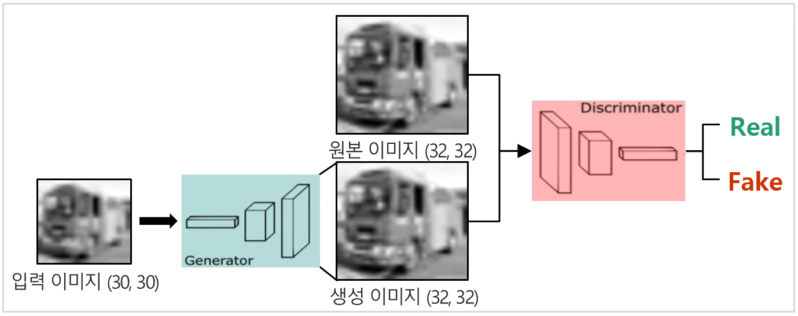
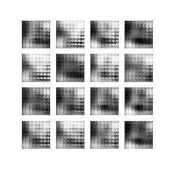

# UpGAN
'인공지능1' 수업 프로젝트(2019.03 ~ 2019.06)  
## 목표  
- DCGAN(Deep Convolutional GAN)을 통해 이미지의 화질을 개선하는 프로젝트  
- Generator가 (30, 30)을 입력으로 받아서 (32, 32) 이미지를 생성하며 Discriminator가 원본인지 가짜인지를 판단  

## Architecture  

  

## 적용 결과  

  
- GAN을 통해 생성된 이미지가 차량의 형태를 띠기는 했지만, 원본 이미지에 미치지 못함
- 단순한 모델과 적은 데이터, 적절하지 않은 Loss가 문제라고 판단
